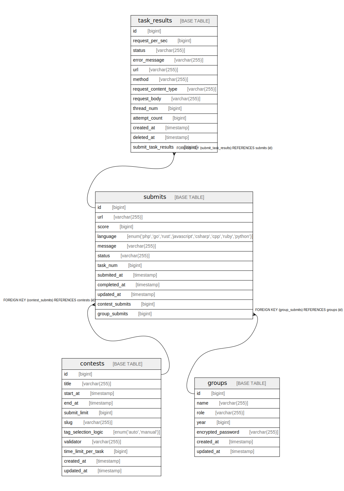

# exp-a

## Tables

| Name | Columns | Comment | Type |
| ---- | ------- | ------- | ---- |
| [contests](contests.md) | 11 | コンテスト(予選・本戦を管理するため) | BASE TABLE |
| [groups](groups.md) | 7 | グループ(ユーザ) | BASE TABLE |
| [submits](submits.md) | 12 | グループの提出を管理するテーブル | BASE TABLE |
| [task_results](task_results.md) | 13 | タスク(タグ)ごとの結果を管理するテーブル | BASE TABLE |

## Relations

---

> Generated by [tbls](https://github.com/k1LoW/tbls)
