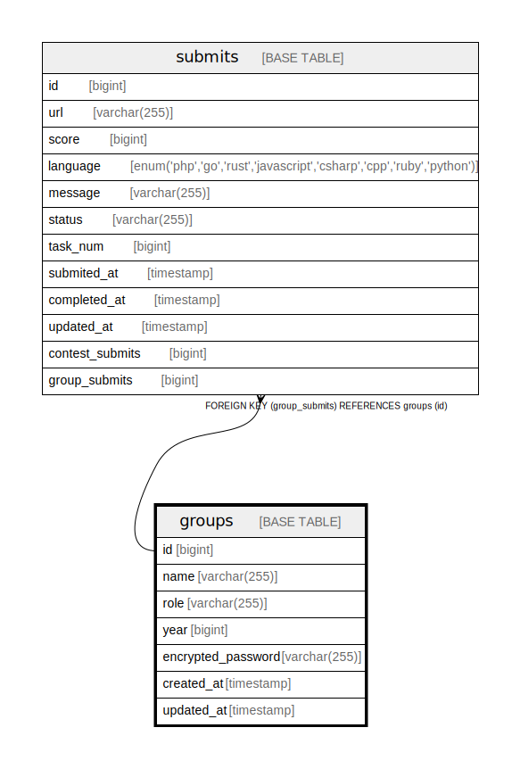

# groups

## Description

グループ(ユーザ)

<details>
<summary><strong>Table Definition</strong></summary>

```sql
CREATE TABLE `groups` (
  `id` bigint NOT NULL AUTO_INCREMENT,
  `name` varchar(255) COLLATE utf8mb4_bin NOT NULL,
  `role` varchar(255) COLLATE utf8mb4_bin NOT NULL,
  `year` bigint NOT NULL,
  `encrypted_password` varchar(255) COLLATE utf8mb4_bin NOT NULL,
  `created_at` timestamp NOT NULL,
  `updated_at` timestamp NULL DEFAULT NULL,
  PRIMARY KEY (`id`),
  UNIQUE KEY `group_name_year` (`name`,`year`)
) ENGINE=InnoDB AUTO_INCREMENT=[Redacted by tbls] DEFAULT CHARSET=utf8mb4 COLLATE=utf8mb4_bin
```

</details>

## Columns

| Name | Type | Default | Nullable | Extra Definition | Children | Parents | Comment |
| ---- | ---- | ------- | -------- | ---------------- | -------- | ------- | ------- |
| id | bigint |  | false | auto_increment | [submits](submits.md) |  | グループID(PK) |
| name | varchar(255) |  | false |  |  |  | グループ名 |
| role | varchar(255) |  | false |  |  |  | グループの役割(ADMIN, CONTESTANT, GUEST)。proto に定義されている。 |
| year | bigint |  | false |  |  |  | グループの年度 |
| encrypted_password | varchar(255) |  | false |  |  |  | パスワードのハッシュ |
| created_at | timestamp |  | false |  |  |  | 作成日時 |
| updated_at | timestamp |  | true |  |  |  | 更新日時 |

## Constraints

| Name | Type | Definition |
| ---- | ---- | ---------- |
| group_name_year | UNIQUE | UNIQUE KEY group_name_year (name, year) |
| PRIMARY | PRIMARY KEY | PRIMARY KEY (id) |

## Indexes

| Name | Definition | Comment |
| ---- | ---------- | ------- |
| PRIMARY | PRIMARY KEY (id) USING BTREE |  |
| group_name_year | UNIQUE KEY group_name_year (name, year) USING BTREE | name と year の unique index |

## Relations



---

> Generated by [tbls](https://github.com/k1LoW/tbls)
