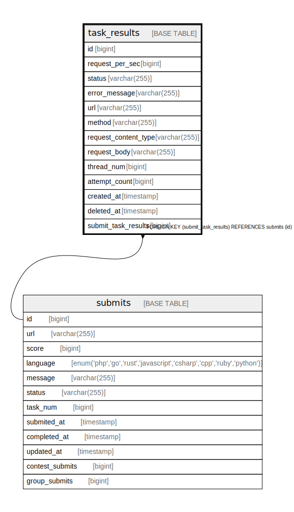

# task_results

## Description

タスク(タグ)ごとの結果を管理するテーブル

<details>
<summary><strong>Table Definition</strong></summary>

```sql
CREATE TABLE `task_results` (
  `id` bigint NOT NULL AUTO_INCREMENT,
  `request_per_sec` bigint NOT NULL,
  `status` varchar(255) COLLATE utf8mb4_bin NOT NULL,
  `error_message` varchar(255) COLLATE utf8mb4_bin DEFAULT NULL,
  `url` varchar(255) COLLATE utf8mb4_bin NOT NULL,
  `method` varchar(255) COLLATE utf8mb4_bin NOT NULL,
  `request_content_type` varchar(255) COLLATE utf8mb4_bin NOT NULL,
  `request_body` varchar(255) COLLATE utf8mb4_bin DEFAULT NULL,
  `thread_num` bigint NOT NULL,
  `attempt_count` bigint NOT NULL,
  `created_at` timestamp NOT NULL,
  `deleted_at` timestamp NULL DEFAULT NULL,
  `submit_task_results` bigint DEFAULT NULL,
  PRIMARY KEY (`id`),
  KEY `task_results_submits_taskResults` (`submit_task_results`),
  CONSTRAINT `task_results_submits_taskResults` FOREIGN KEY (`submit_task_results`) REFERENCES `submits` (`id`) ON DELETE SET NULL
) ENGINE=InnoDB DEFAULT CHARSET=utf8mb4 COLLATE=utf8mb4_bin
```

</details>

## Columns

| Name | Type | Default | Nullable | Extra Definition | Children | Parents | Comment |
| ---- | ---- | ------- | -------- | ---------------- | -------- | ------- | ------- |
| id | bigint |  | false | auto_increment |  |  | タスク結果ID(PK) |
| request_per_sec | bigint |  | false |  |  |  | 秒間リクエスト数(これの総和がスコアになる) |
| status | varchar(255) |  | false |  |  |  | ステータス。proto に定義されている。 |
| error_message | varchar(255) |  | true |  |  |  | エラーメッセージ |
| url | varchar(255) |  | false |  |  |  | 提出の URL |
| method | varchar(255) |  | false |  |  |  | http method(使われていない) |
| request_content_type | varchar(255) |  | false |  |  |  | request Content-Type(使われていない) |
| request_body | varchar(255) |  | true |  |  |  | request body(使われていない) |
| thread_num | bigint |  | false |  |  |  | 使われたスレッドの数(使われていない) |
| attempt_count | bigint |  | false |  |  |  | そのタスクでリクエストが行われてた数(使われていない) |
| created_at | timestamp |  | false |  |  |  | 作成日時 |
| deleted_at | timestamp |  | true |  |  |  |  |
| submit_task_results | bigint |  | true |  |  | [submits](submits.md) |  |

## Constraints

| Name | Type | Definition |
| ---- | ---- | ---------- |
| PRIMARY | PRIMARY KEY | PRIMARY KEY (id) |
| task_results_submits_taskResults | FOREIGN KEY | FOREIGN KEY (submit_task_results) REFERENCES submits (id) |

## Indexes

| Name | Definition |
| ---- | ---------- |
| task_results_submits_taskResults | KEY task_results_submits_taskResults (submit_task_results) USING BTREE |
| PRIMARY | PRIMARY KEY (id) USING BTREE |

## Relations



---

> Generated by [tbls](https://github.com/k1LoW/tbls)
